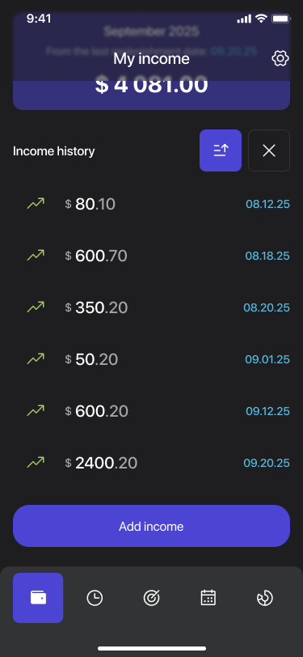
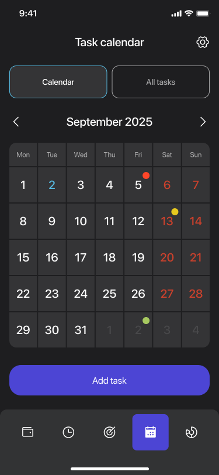
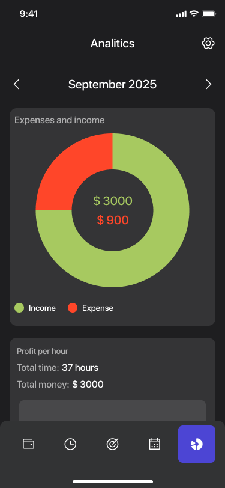

# WorkWise: Process Optimizer

**WorkWise** is a Flutter app designed to improve productivity and financial awareness. Track your income, log working hours, plan tasks, and visualize your monthly performance — all in one smart workspace.


## 🛠️ Technologies

- **Flutter** and **Dart**
- **Provider** — state management
- **Hive** — local storage
- **Flutter ScreenUtil** — responsive layout
- **Custom widgets** — time inputs, pie charts, history tracking
- **Local assets** — icons, theme elements, and UI illustrations

## 📱 Screenshots

| Income | Calendar | Analytics |
|-----------------|----------|-----------|
|  |  |  |

## 🚀 How to Run

1. Clone the repo
   ```sh
   git clone https://github.com/NMMustafina/work_wise_process_optimizer.git
   ```
2. Install all the packages by typing the following command
   ```sh
   flutter pub get
   ```
3. Run the App
